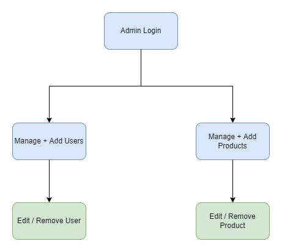
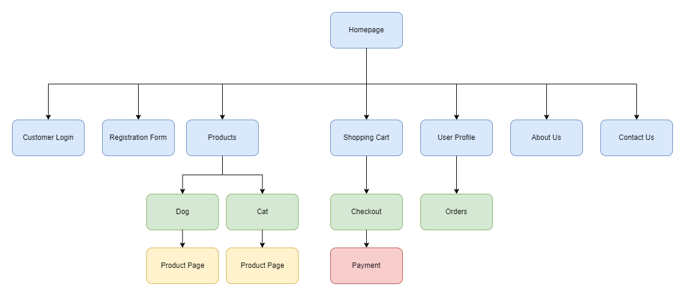
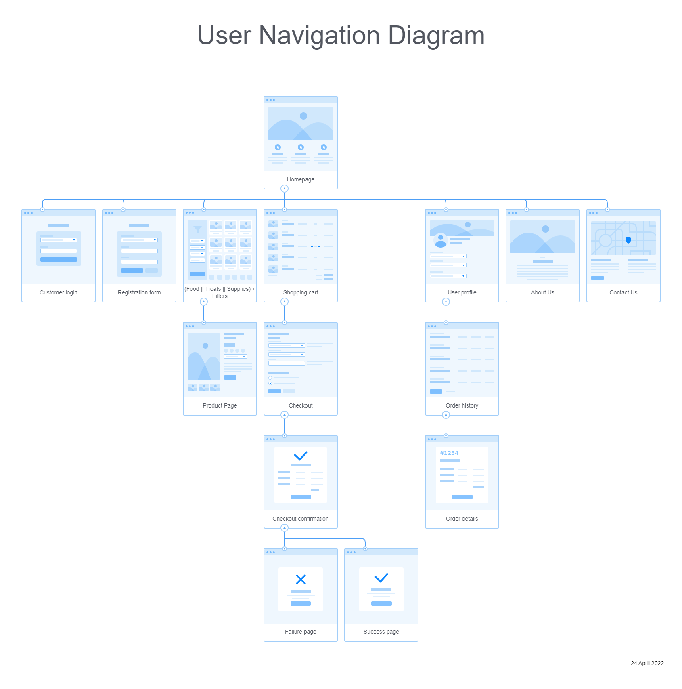
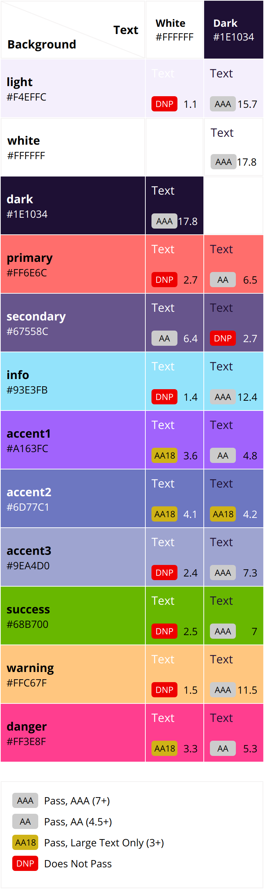

# fluffshop - E-commerce Web Project


Projeto final para a disciplina de Introdução ao Desenvolvimento Web (SCC0219).
Feito por:

| Identificador | Nome                           |
| ------------- | ------------------------------ |
| 11884713      | Paulo Henrique de Souza Soares |
| 11795680      | Natan Henrique Sanches         |
| 10873365      | Álvaro José Lopes              |

## 0. Introdução

### 0.1. Sumário do Documento

- [fluffshop - E-commerce Web Project](#fluffshop---e-commerce-web-project)
	- [0. Introdução](#0-introdução)
		- [0.1. Sumário do Documento](#01-sumário-do-documento) 
		- [0.2. Detalhes da empresa fictícia](#02-detalhes-da-empresa-fictícia)
		- [0.3. Protótipos](#03-protótipos)
	- [1. Documento de Requisitos](#1-documento-de-requisitos)
		- [1.1. Requisitos da aplicação](#11-requisitos-da-aplicação)
		- [1.2. Requisitos da base de dados](#12-requisitos-da-base-de-dados)
	- [2. Descrição do Projeto](#2-descrição-do-projeto)
		- [2.1. Descrição Geral](#21-descrição-geral)
		- [2.2. Diagramas de Navegação](#22-diagramas-de-navegação)
		- [2.3. Tabela de Cores](#23-tabela-de-cores)
	- [3. Comentários sobre o Código](#3-comentários-sobre-o-código)
	- [4. Planos de Teste](#4-planos-de-teste)
		- [4.1. Testes Propostos](#41-testes-propostos)
		- [4.2. Resultados dos Testes](#42-resultados-dos-testes) 
	- [5. Procedimento de Execução](#5-procedimento-de-execução)
	- [6. Problemas](#6-problemas)
	- [7. Comentários](#7-comentários)

### 0.2. Detalhes da empresa fictícia

-   **Nome:** Fluffshop
-   **Área de atuação:** _Pet-shop_ para cães e gatos.

### 0.3. Protótipos

#### Figma

<a href="https://www.figma.com/file/LzWsi7yFEvNQ4pdKTXLKaw/fluffshop?node-id=53%3A162" target="_blank">
Link para o projeto no Figma
</a>

#### Navegação Figma

<a href="https://www.figma.com/proto/LzWsi7yFEvNQ4pdKTXLKaw/fluffshop?node-id=56%3A823&scaling=scale-down-width&page-id=0%3A1&starting-point-node-id=56%3A823" target="_blank">
Link para o protótipo com navegação completa no Figma
</a>

#### HTML/CSS

<a href="https://opaulosoares.github.io/ecommerce-web-project/" target="_blank">
Protótipo em HTML + CSS
</a>

-   3 páginas feitas em HTML e CSS, como especificado.
    -   "Homepage", "Login" e "Foods"
-   Botões interativos nesse protótipo:
    -   "Sign In"
    -   "Foods"

## 1. Documento de Requisitos

### 1.1. Requisitos da aplicação

-   O sistema deve possuir dois tipos de usuários: **comum e administrador**.

    -   No sistema, os **administradores** são responsáveis por gerir outros administradores e produtos exibidos no site. O **administrador** possui **nome**, **identificador**, **telefone** e **e-mail**.
    -   No sistema, os usuários **comuns** utilizam o sistema para comprar produtos de Pet Shop. Os usuários **comuns** possuem **nome**, **identificador**, **telefone**, **endereço** e **e-mail**.

-   O sistema possui uma série de **produtos** que são exibidos para a compra _on-line_. Os registros dos **produtos** são compostos por **nome**, **identificador**, **foto**, **descrição**, **preço**, **quantidade em estoque**, **quantidade vendida**, **espécie do animal**, **idade do animal** e **tipo do produto**.

#### Administrador

-   No sistema, o administrador pode **inserir** novos produtos para serem exibidos na loja.
-   No sistema, o administrador tem acesso às **listas** contendo os produtos ativos e inativos na loja.
-   No sistema, o administrador pode **remover** um produto existente na loja.
-   No sistema, o administrador pode dar o cargo de **Administrador** a um usuário **comum**.

#### Usuário comum

-   No sistema, o usuário pode se **registrar** utilizando seu **e-mail**, **senha**, **nome**, **endereço** e **telefone**. Ao ser registrado, o usuário possui um perfil próprio no site ligado com seu **e-mail** e **senha**.
-   No sistema, um usuário comum pode **cadastrar** um número de cartão de crédito para pagamento.
-   No sistema, um usuário comum pode **procurar** por produtos através de uma barra de pesquisa.
-   No sistema, um usuário comum pode **adicionar** produtos desejados ao carrinho de compras.
-   No sistema, um usuário comum pode **remover** produtos do carrinho de compras.

#### Funcionalidade extra

-   O sistema é capaz de filtrar produtos com base no tipo do produto e no animal destinado.

#### Requisitos não-funcionais

-   O sistema deve ser responsivo e possuir boa usabilidade.
-   O sistema deve conter funcionalidades de acessibilidade para usuários.

### 1.2. Requisitos da base de dados

- **Usuário**
    - Email
    - Senha
    - Nome
    - ZIP Code
    - Endereços
    - Telefone
    - País
    - Estado

- **Produto**
    - Identificador
    - Nome
    - Descrição
    - Foto
    - Preço
    - QuantidadeEstoque
    - QuantidadeVendida
    - EspécieAnimal
    - IdadeAnimal
    - TipoProduto

**OBS** Admins são inseridos pelo primeiro Admin do sistema por questões de segurança.

#### Filtros

- **Alimentos (Food)**
    - **EspécieAnimal**
        - Cachorro (Dog)
        - Gato (Cat)
    - **IdadeAnimal**
        - Recém-nascido (Newborn)
        - Adulto (Adult)
        - Idoso (Senior)
    - **TipoProduto**
        - Seca (Dry)
        - Úmida (Wet)
        - Congelada (Frozen)

- **Petiscos (Treats)**
    - **EspécieAnimal**
        - Cachorro (Dog)
        - Gato (Cat)
    -   **IdadeAnimal**
        - Recém-nascido (Newborn)
        - Adulto (Adult)
        - Idoso (Senior)
    -   **TipoProduto**
        - Macio (Soft)
        - Mastigável (Chewy)
        - Dental

- **Suprimentos (Supplies)**
    - **EspécieAnimal**
        - Cachorro (Dog)
        - Gato (Cat)
    - **IdadeAnimal**
        - Recém-nascido (Newborn)
        - Adulto (Adult)
        - Idoso (Senior)
    - **TipoProduto**
        - Roupas & Acessórios (Clothes & Accessories)
        - Camas (Beds)
        - Comedouros (Bowls & Feeders)
        - Coleiras (Collars, Leashes and Harnesses)
        - Gaiolas e caixas (Gates, Crates & Kernels)
        - Tosa (Grooming)
        - Brinquedos (Toys)

## 2. Descrição do projeto

### 2.1. Descrição Geral

O _e-commerce_ desenvolvido para a disciplina foi o de uma _pet-shop_, _Fluffshop_, caracterizada em produtos para cães e gatos (alimentos, suprimentos e petiscos).

-   O site da _Fluffshop_ permite que o usuário veja a listagem de produtos disponíveis em estoque. Com isso, o usuário pode comprar algum produto colocando-o no carrinho e especificando sua quantidade. Em seguida, o pagamento é feito através de um número de cartão de crédito. Após processada a compra e efetuado o pagamento, o carrinho é esvaziado.

-   No sistema, estão cadastrados os produtos do tipo _Food_ (alimentos), _Supplies_ (suprimentos) e _Treats_ (petiscos). Cada produto distinto possui a sua própria página e esses podem ser filtrados de acordo com seu tipo. Dentre os produtos, são exibidos uma foto, seu nome, sua descrição e seu preço. Além disso, o usuário pode conferir uma seção que indica para qual tipo de _pet_ aquele produto é recomendado.
-   A manutenção dos produtos cadastrados é feita pelo administrador, que pode listar/inserir/remover produtos no banco de dados do sistema. O administrador é responsável pela manutenção do sistema como um todo, e também por gerir outros administradores.

-   O sistema também possui recursos não-funcionais, englobando contextos como **usabilidade**, **responsividade** e **acessibilidade**:

    -   **Usabilidade:** O site foi implementado visando as boas práticas no ramo de UI (_User Interface_) e UX (_User Experience_), contando com páginas diretas e limpas, com fácil navegação por parte do usuário.

    -   **Responsividade:** O site foi implementado de maneira que pudesse ser exibido, sem perda de informação ou deformação dos componentes, em qualquer tipo de tela.

    -   **Acessibilidade:** O site conta com um mecanismo de mudança de cores no estilo claro/escuro, respeitando os padrões visuais WCAG, de forma que torne-se acessível a usuários com problemas de visão.

### 2.2. Diagramas de navegação

Diagrama de navegação do administrador.



Uma versão simplificada do diagrama de navegação do site pode ser vista a seguir.



Além desta, também foi produzido um diagrama sendo uma versão mais detalhada da navegação, de maneira que pudesse ser visto o relacionamento entre as páginas com maior precisão.



### 2.3. Tabela de Cores

Tabela de cores com seus respectivos testes de acessibilidade no padrao WCAG 2.0.



Nem todas cores devem passar nos testes, pois nem todas são usadas como texto ou fundo do texto. Contudo, as cores "dark" e "white" estão compatíveis entre si no padrão WCAG 2.0, o que é extrememamente relevante para a acessibilidade do site, visto que serão as cores mais usadas para o texto e fundo do texto. O nome e variações das cores restantes podem ser modificadas durante o progresso do projeto, porém as cores "dark" e "white" serão mantidas, além das cores oficiais da marca. Essa prática de refatoração é bastante comum em projetos como esse, pois o produto encontra-se em constante evolução.

## 3. Comentários sobre o Código

O grupo não viu necessidade de acrescentar comentários sobre o código. O desenvolvimento do conteúdo do site fluiu bem, sem maiores problemas.

## 4. Planos de Teste

Para todos os planos de teste, foram utilizadas duas contas base.
- Como cliente:
```
E-mail: john@email.com
Senha: 123
```

- Como administrador:
```
E-mail: admin@shop.com
Senha: admin
```

### 4.1. Testes Propostos

#### Teste de __log-in__ como usuário comum

1. No canto superior direito, clique no botão azul `Login`.
2. Preencha as informações relativas ao __log-in__, sendo uma conta de usuário comum.
3. Após preenchidas as informações, clique no botão em azul `Login`, abaixo dos campos preenchidos.
4. Se as informações estiverem corretas, o usuário agora está logado e será redirecionado para a página principal.

#### Teste do fluxo do usuário cliente

1. No canto superior direito, clique no botão azul `Login`.
2. Preencha as informações relativas ao __log-in__, sendo uma conta de usuário comum, e realize o __log-in__.
3. Coloque alguns produtos no carrinho, utilizando o botão `Add to Cart`.
4. Acesse o carrinho utilizando o botão de carrinho, ao lado do nome da conta, no canto superior direito.
5. Configure as quantidades dos produtos de acordo com o desejado. Há também a possibilidade de remover produtos com o botão de `Lixeira`.
6. No carrinho, clique em `Go to Checkout`, no canto superior direito.
7. Confira o valor dos produtos e o valor total e continue com o pedido, através do botão azul `Confirm Order`, no canto inferior esquerdo.
8. Confirme o endereço de entrega através do botão azul `Finish Order`.
9. O pedido foi feito com êxito.

#### Teste da alteração de informações da conta do cliente

1. As informações do cliente podem ser encontradas ao clicar no nome do usuário (nesse caso, 'Johnny') no canto superior direito, em azul. 
2. Na página com as informações do usuário, preencha as novas informações desejadas.
3. Após preencher todas as informações, clique no botão `Edit Your Account` no fim da página.
4. As novas informações foram salvas.

#### Teste de permissão de usuário comum

1. Se logado como usuário comum (nesse caso, com a conta `john@email.com`), o usuário é barrado de acessar as rotas de administrador (como `/admin/dashboard`) através da mensagem de erro `Please log-in as admin to see this page!`. A rota só pode ser acessada por uma conta de administrador.

#### Teste de __log-in__ como usuário administrador

1. Acesse a rota `/admin`.
2. Preencha as informações relativas ao __log-in__, sendo uma conta de usuário administrador.
3. Após preenchidas as informações, clique no botão em azul `Login`, abaixo dos campos preenchidos.
4. Se as informações estiverem corretas, o administrador agora está logado e será redirecionado para a página principal de administrador.

#### Teste de edição de produtos

1. Acesse a rota `/admin`.
2. Preencha as informações relativas ao __log-in__, sendo uma conta de usuário administrador, e realize o __log-in__.
3. Na página principal, selecione um produto e clique no botão branco `Edit`.
4. Modifique alguns dos atributos.
5. Salve as modificações clicando no botão `Confirm Changes`, em azul.
6. As novas informações do produto estão salvas.

#### Teste de remoção de produtos

1. Acesse a rota `/admin`.
2. Preencha as informações relativas ao __log-in__, sendo uma conta de usuário administrador, e realize o __log-in__.
3. Na página principal, selecione um produto e clique no botão vermelho `Remove`.
4. Confirme a remoção através do botão `Yes`.
5. O produto foi removido.

#### Teste de edição de usuários

1. Acesse a rota `/admin`.
2. Preencha as informações relativas ao __log-in__, sendo uma conta de usuário administrador, e realize o __log-in__.
3. Clique na aba `Users`, abaixo do __banner__ da loja.
4. Selecione um usuário e clique no botão `Edit`, em branco.
5. Modifique alguns dos atributos do usuário.
6. Salve as modificações clicando no botão `Confirm Changes`, em azul.
7. As novas informações do usuário estão salvas.

### 4.2. Resultados dos Testes

Todos os testes tiveram o resultado esperado.

## 5. Procedimento de Execução

#### Inicializando o back-end

De início, é necessário ir até a pasta `backend`. Na raiz do projeto:

```shell
cd backend
```

Logo após, começamos instanciando o MongoDB. 

```shell
sudo service mongodb start
mongosh mongodb://localhost:27017/fluffshop
```

Após execução, saia do _shell_ interativo do MongoDB.

Em seguida, instale as dependências do _back-end_ do projeto através dos comandos

```shell
npm install
npm run populate
```

Por fim, inicialize a API através do comando

```shell
npm start
```

API está rodando no endereço `http://localhost:3000`.

#### Inicializando o front-end

De início, é necessário ir até o diretório `frontend`. Na raiz do projeto e em outro terminal:

```shell
cd frontend
```

Em seguida, instalamos as dependências do _front-end_ do projeto através dos comando

```shell
npm install
```

Executamos o _front-end_ através do comando

```shell
npm run serve
```

O site, agora, está ativo no endereço `http://localhost:8080`.

## 6. Problemas

Não foram encontrados problemas críticos no desenvolvimento do projeto.

## 7. Comentários

O grupo não viu necessidade de acrescentar comentários extras.
